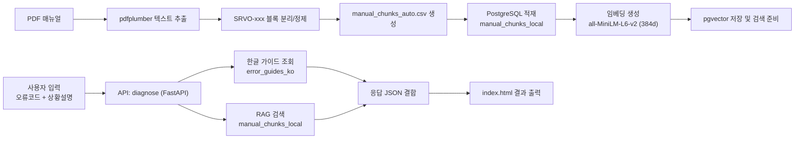

# Factory Doctor - FANUC Agent (팩토리 닥터)

**스마트 제조 AI Agent 해커톤 2025 <본선>** 참가 프로젝트  
FANUC 로봇(컨트롤러) 매뉴얼 기반으로 **설비 오류코드 진단 + 복구 가이드**를 제공하는 RAG 에이전트 MVP입니다.

---

## 🏁 대회 제목 / 개요

### 스마트 제조 AI Agent 해커톤 2025
최근 AI는 문제 발견~해결까지 수행하는 자율형 시스템으로 발전하고 있으며, 제조 산업에서는 방대한 매뉴얼·보고서·공정데이터 기반의 AX 수요가 증가하고 있습니다.  
본 대회는 **제조 도메인 특화 LLM·RAG 기반 AI Agent**를 MVP 형태로 설계·구현·시연하는 것을 목표로 합니다.

- 온라인 예선: MVP 기획서 제출 → 상위 선발 본선 진출
- 오프라인 본선: 예선 기획서 기반 실제 MVP 구현/시연

---

## 🎯 우리가 선정한 주제

### FANUC 로봇 매뉴얼 RAG 기반 “오류코드 진단 & 복구 가이드” 에이전트
- 현장에서는 “오류코드 + 상황설명”만으로 **즉시 조치**가 필요한 경우가 많음
- 특정 설비로 범위를 좁혀 데이터/시나리오를 명확히 하기 위해 **FANUC 로봇**으로 도메인을 한정
- 매뉴얼 원문 근거(영문) + 한글 요약 가이드(절차/주의사항)를 함께 제공

---

## 🧩 구현 요약

### 핵심 흐름
1. **PDF 매뉴얼 → CSV 자동 변환**
   - pdfplumber로 텍스트 추출 후 `SRVO-xxx` 기준으로 블록을 분리하여 CSV 생성
2. **PostgreSQL 적재 + pgvector 임베딩**
   - 문단(content)을 `all-MiniLM-L6-v2 (384d)`로 임베딩 후 `vector(384)` 컬럼에 저장
3. **사용자 입력(오류코드 + 설명) → RAG 검색**
   - `/diagnose` API에서
     - `error_guides_ko` : 한글 가이드(요약/주의/절차) 조회
     - `manual_chunks_local` : pgvector 유사도 검색으로 매뉴얼 근거 문단 조회
4. **HTML에서 결과 출력**
   - `index.html`에서 오류코드/상황을 입력하면 `/diagnose` 호출 → 결과 렌더링

---

## 🏗️ 아키텍처

---

## 🎬 시연 영상 (YouTube)

- 시연 흐름(요약)
  1) 오류코드(SRVO-xxx) 및 현장 상황 입력  
  2) RAG 검색 기반으로 매뉴얼 근거 문단 + 한글 조치 가이드 출력  
  3) 수리 절차에 따라 점검/조치 방향 확인  

---

## 🙋‍♂️ 내가 맡은 파트 (유영찬)

### 예선
- 팀 아이디어(매뉴얼 RAG 기반 설비 에러 진단/복구 가이드)에서
- 설비 범위를 명확히 하기 위해 **FANUC 로봇으로 도메인을 한정**
- FANUC 매뉴얼 리서치 및 **시나리오/데이터 구성/기술 활용 계획** 정리

### 본선
- **MVP 구현 전반을 주도**
  - 매뉴얼 **PDF → CSV 자동 변환 파이프라인** 추가 및 적용
  - PostgreSQL(+pgvector) 기반 **데이터 적재/임베딩 저장/유사도 검색** 구현
  - FastAPI 기반 `/diagnose` API 구현 및 HTML UI 연동
  - 전체 흐름 오케스트레이션(main.py 중심) 및 시연 시나리오 구성

---

## 🛠️ 사용 기술 / 도구

### Backend
- **Python**
- **FastAPI**
- **Pydantic**: 요청 바디(JSON) 스키마/검증
- **Jinja2 Templates**: `index.html` 템플릿 서빙

### DB / Vector Search
- **PostgreSQL**
- **pgvector** (embedding vector 저장 및 유사도 검색)

### Embedding / RAG
- **sentence-transformers** (`all-MiniLM-L6-v2`, 384-dim)

### Data Processing
- **pdfplumber** (PDF 텍스트 추출)
- **정규식 기반 파싱** (`SRVO-xxx` 블록 분리 → CSV chunk 생성)

### Frontend
- **HTML / Vanilla JS** (`/diagnose` 호출 후 결과 렌더링)

---

## 📎 제출 / 증빙 자료

- 📄 **예선 기획서**: [스마트 제조 AI Agent 해커톤 2025 팩토리 닥터.pdf](./concept_paper/%EC%8A%A4%EB%A7%88%ED%8A%B8%20%EC%A0%9C%EC%A1%B0%20AI%20Agent%20%ED%95%B4%EC%BB%A4%ED%86%A4%202025%20%ED%8C%A9%ED%86%A0%EB%A6%AC%20%EB%8B%A5%ED%84%B0.pdf)
- 🏅 **인증서**: [Certificate.pdf](./certificate/Certificate.pdf)
- ✅ **최종 기록**: 본선 진출

---
